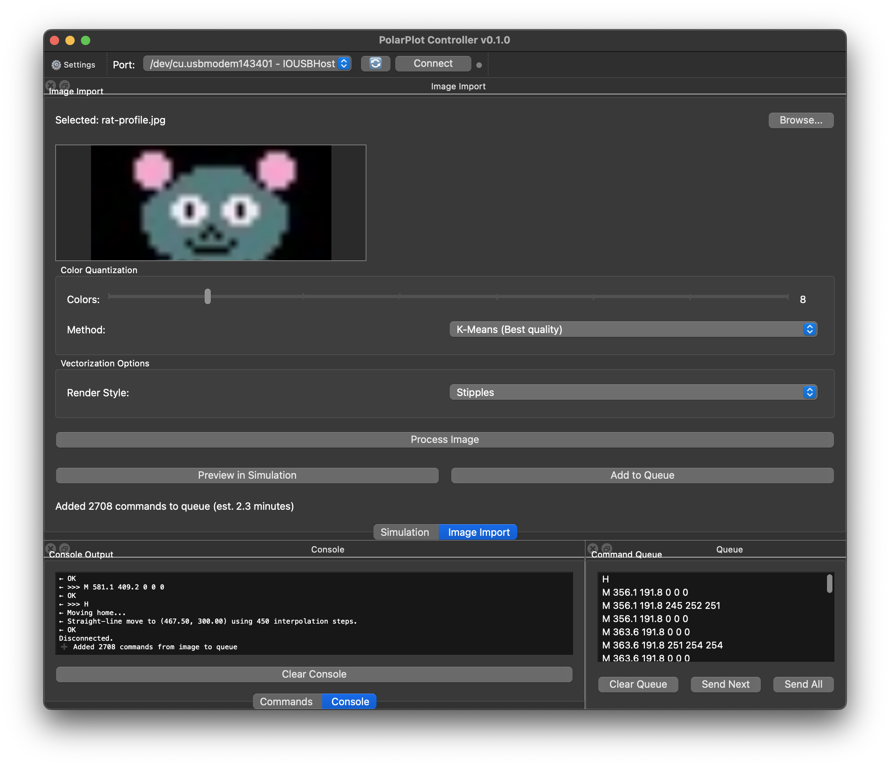
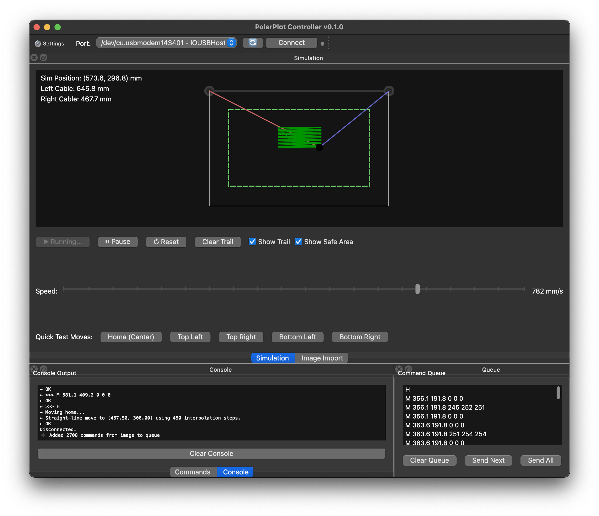
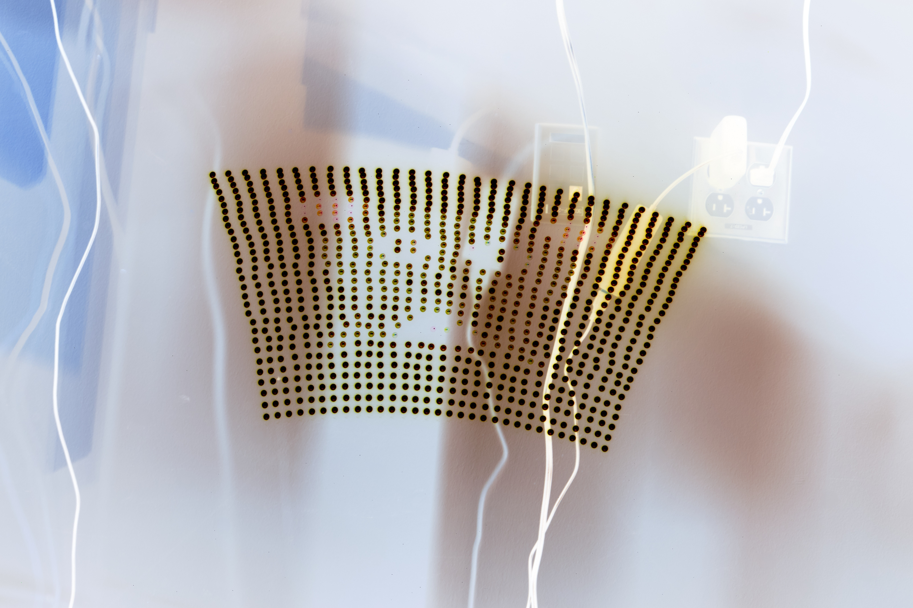
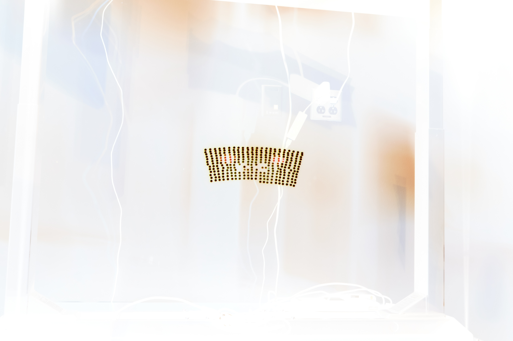
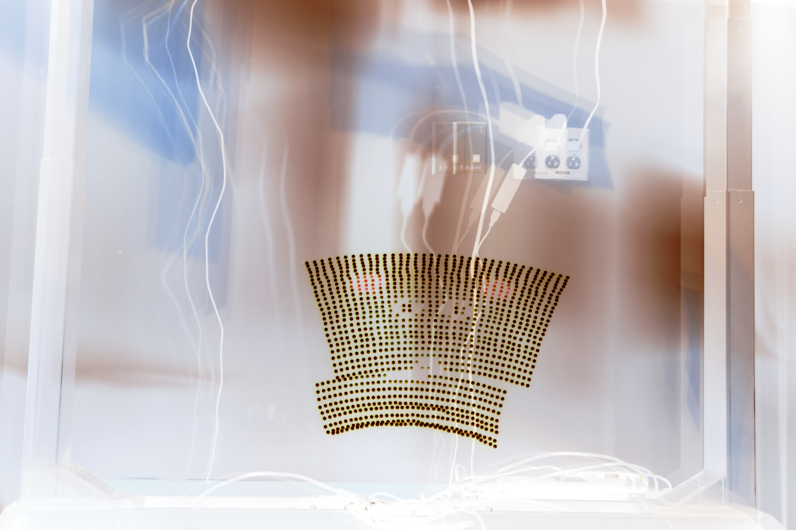
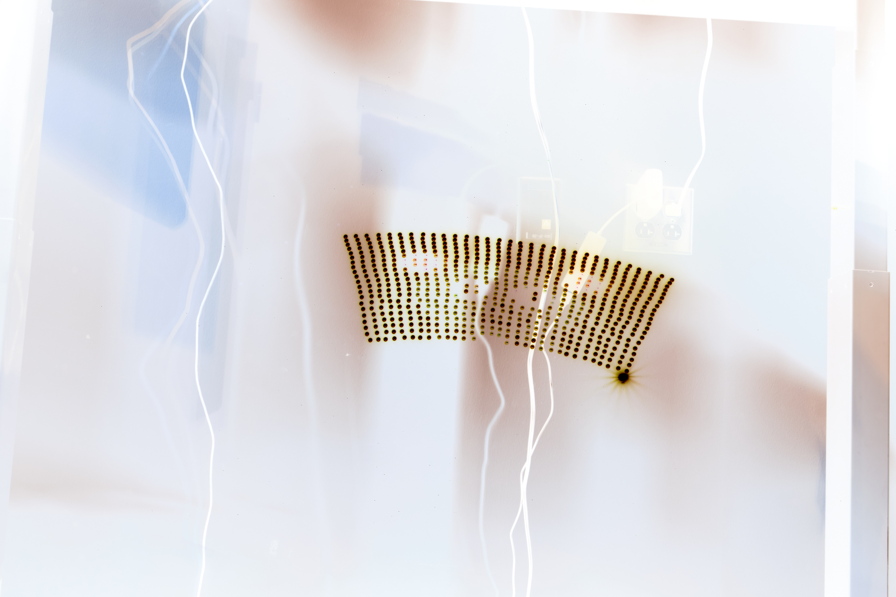

# LED Plotter

A hanging pen plotter system using polar kinematics to control a suspended drawing mechanism.

## Overview

This project consists of two main components:

1. **PyQt6 Desktop Application** - GUI controller for sending commands and visualizing plotter state
2. **Arduino Firmware** - Stepper motor control and kinematics calculations

The system uses two stepper motors mounted at fixed positions to control cable lengths, positioning a gondola/pen holder in 2D space using polar coordinates.

## Quick Start

### Python App

```bash
cd App/
pixi install              # Install dependencies
pixi run python app.py    # Launch GUI
```

### Arduino Firmware

Upload `Arduino/simple-led-plotter.ino` using Arduino IDE or arduino-cli.

**Requirements:**

- AFMotor_R4 library
- FastLED library
- Serial baud rate: 9600

## Project Structure

```
LED-plotter/
├── App/                          # PyQt6 desktop application
│   ├── app.py                    # Main entry point
│   ├── models.py                 # Data models and constants
│   ├── serial_handler.py         # Background serial communication
│   └── ui/                       # Modular UI components
├── Arduino/
│   └── simple-led-plotter.ino    # Firmware for stepper motor control
└── CLAUDE.md                     # AI assistant onboarding
```

## Hardware

- Nema 17 stepper motors (200 steps/revolution)
- Adafruit Motor Shield R4 (knockoff)
- WS2812 LED

## Documentation

### Photos

#### Python App





#### Hardware


#### Results - Long Exposure LED Plotter Output









### Videos

#### First Movement Test

[first-movement.MOV](docs/first-movement.MOV)

#### Square Test Pattern (Not so square is it :( )

[square-test.MOV](docs/square-test.MOV)

### Description

A description of the piece (and title if applicable). At least 1 paragraph about what you've created, what you learned, tools, techniques, and anything else that makes your project interesting. Tell a story.

This project was an idea I had a few years ago but never had the time to execute.

The idea is to create a hanging plotter that uses two motors to control the position of a pen (or LED) on a vertical surface. This idea of a hanging plotter isn't new, but I realized I could replace the traditional pen with an LED, which, when combined with long exposure photography, could create interesting light paintings. So that's what I did.

The process contained a lot of different challenges and it's still not at a point I'm fully satisfied with, but I'm happy with how far I've gotten. The hardware side was actually pretty straightforward. The motors were just plug and play with the motor shield, the mounting of everything was easy as I was able to find all the 3d models I needed online, and the minimal soldering required was manageable (and fun to gain more practice with). The only hardware challenge was properly powering the motors. I had thought I had a power supply that could handle the load, but it turned out to be insufficient.

The software side was more challenging. I decided to test out partial "vibe" coding for some aspects. I do think it sped up development in some areas, but also let to messy code and bloat. I tried using a tailored CLAUDE.md file to help with context but honestly I don't think it made much of a difference. That was a good learning experience though and I ended up with a functional application (though ugly and confusing to use) that can send commands to the plotter and also simulate the plotter movements before sending them. I also implemented a image to "gcode" (fake gcode) converter that can take any image and convert it into svg paths and then into plotter commands. This was a place where the AI messed up a lot, so I ended up rewriting nearly all of it myself. I also just went with a basic grid-based stippling algorithm instead of something more advanced (or something path based like sine-waves or nearest neighbor). The results are okay, but there is LOTS of room for improvement. It's also just strange working with svgs rather than pixels (I miss shaders).

Anyway, lots of learning, but also some basic functionality that needs to be refined. Overall I'm happy with the project and I think it has potential to be something really cool with more time and effort.
